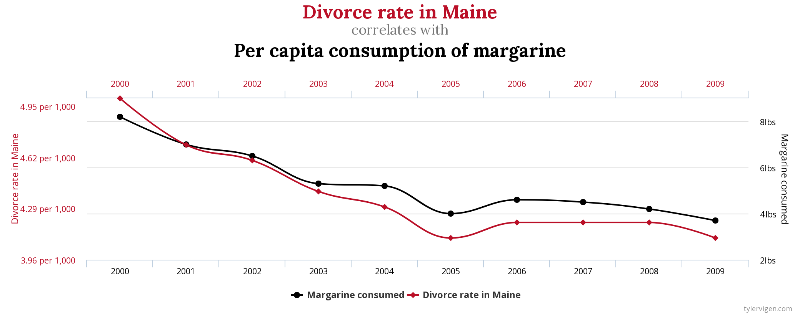

<a href="https://ki-campus.org/">

</a>

```{r setup, include=FALSE}
library(learnr)
library(knitr)
library(ggplot2)
library(dplyr)
library(tidyr)
library(emojifont)

theme.fom <- theme_classic(22*1.04)
theme.fom <- theme.fom
theme_set(
  theme.fom  
)


library(ggdag)
# DAG
co <- data.frame(x=c(0,1), y=c(0,0), name=c("X", "Y"))
DAG_SG <- dagify(Y ~ X,
                 coords = co) %>% 
  ggdag() + 
  geom_dag_point(colour = c("#0F710B", "#0000FF")) + 
  geom_dag_text(size = 8) +
  theme_dag_blank() +
  geom_dag_edges(arrow_directed = grid::arrow(length = grid::unit(15, "pt"), type = "closed")) +
  geom_text(label = "X - Storks\nY - Births", 
            hjust = 1, vjust = 2,
            x = 1, y = 0, size = 7, color = "darkgrey") 

co <- data.frame(x=c(0,1,2), y=c(0,1,0), name=c("X", "Z", "Y"))
DAG_Fork <- dagify(X ~ Z,
                    Y ~ Z,
                   coords = co) %>% 
  ggdag() + 
  geom_dag_point(colour = c( "#DA70D6", "#0F710B", "#0000FF")) + 
  geom_dag_text(size = 8) +
  theme_dag_blank() +
  geom_dag_edges(arrow_directed = grid::arrow(length = grid::unit(15, "pt"), type = "closed")) +
  geom_text(label = "X - Storks\nZ - Area\nY - Birts", 
            hjust = 1, vjust = 1,
            x = 2, y = 1, size = 7, color = "darkgrey") 


library(mosaic)

StorksBirths <- tibble(
  country = c("Albania", "Austria", "Belgium", "Bulgaria", "Denmark", "France", "Germany", "Greece", "Holland", "Hungary", "Italy", "Poland", "Portugal", "Romania", "Spain", "Switzerland", "Turkey"),
  area = c(28750, 83860, 30520, 111000, 43100, 544000, 357000, 132000, 41900, 93000, 301280, 312680, 92390, 237500, 504750, 41290, 779450),
  storks = c(100, 300, 1, 5000, 9, 140, 3300, 2500, 4, 5000, 5, 30000, 1500, 5000, 8000, 150, 25000),
  births = c(83, 87, 118, 117, 59, 774, 901, 106, 188, 124, 551, 610, 120, 367, 439, 82, 1576)*1000
)

lm_oA <- lm(births ~ storks, data = StorksBirths)
lm_mA <- lm(births ~ storks + area, data = StorksBirths)
```

## Learning objectives

In this module you will learn:

- about causal forks,

- confounders, and

- that common causes often lead to confusion.


## Congratulations!

A common design for new baby cards is a stork.


<!-- style="padding-left:50px;" -->
<span style="font-size: 10px;"><br>
Quelle: [https://pixabay.com/de/vectors/baby-vogel-lieferung-weiblich-1299514/](https://pixabay.com/de/vectors/baby-vogel-lieferung-weiblich-1299514/)
</span>

But in school we learned that storks do not bring babies.

Or do they?

## The data situation

At the beginning of the millennium, Robert Matthews actually collected data to answer the question ([Source](https://doi.org/10.1111/1467-9639.00013)):

```{r scatter, echo=FALSE, fig.align='center', out.width='85%'}
gf_point(births ~ storks, data = StorksBirths, size = 2, alpha = 0.7) %>%
  gf_lm() %>%
  gf_lims(x=c(0,35000), y=c(0,2000000)) %>%
  gf_text(births ~ storks,
          label = ~ country,
          hjust = 0, vjust = 2, alpha = 0.8, size = 7,
          check_overlap = TRUE) %>%
  gf_labs(x="Number of storks (couples)", y="Births", caption="Data: Robert Matthews")
```


As you can see, there are countries with many storks &ndash; where many babies are born. And countries with comparatively few storks &ndash; where fewer babies are born.


```{r zusammenhang, echo=FALSE}
question("What is the association between the number of storks and the number of births across the $17$ mapped countries?",
         answer("There is a positive correlation between the number of storks ($x$) and the number of births ($y$).", correct = TRUE, message = "Countries with more births also tend to have more storks. This can also be seen in the regression line, which runs from the lower left to the upper right."),
         answer("There is no discernible correlation between the number of storks ($x$) and the number of births ($y$)."),
         answer("There is a negative correlation between the number of storks ($x$) and the number of births ($y$)."),
         allow_retry = TRUE,
         correct = random_praise(),
         incorrect = random_encouragement()
         )
```

## Correlation

The correlation between the <green>number of storks</green> ($\color{green}{x}$) and the <blue>number of births</blue> ($\color{blue}{y}$) is

$$r_{\color{green}{x},\color{blue}{y}} = `r round(cor(births ~ storks, data = StorksBirths),2)`.$$

Correlation coefficients always fall between $-1$ and $+1$. For negative correlations (e.g., between price and sales volume), it becomes less than zero; for positive correlations (e.g., between income and spending), it becomes greater than zero.


So $r_{\color{green}{x},\color{blue}{y}} = `r round(cor(births ~ storks, data = StorksBirths),2)`$ is a relatively large positive correlation. 

In the end, does the following graph apply?

```{r DAG_SG, echo=FALSE, fig.align='center', out.width='85%'}
plot(DAG_SG)
```

```{r pfeil, echo=FALSE}
message <- "The arrow indicates that the value of the variable at the head of the arrow depends on the value of the variable at the end of the arrow &ndash; and not vice versa. See Module 2."
question("What causal assumption is shown in the graph?",
         answer("Storks are the cause, births are the effect.", correct = TRUE, message = message),
         answer("Storks are the effect, births the cause."),
         allow_retry = TRUE,
         correct = random_praise(),
         incorrect = random_encouragement()
         )
```

```{r korrelation, echo=FALSE}
message <- "The correlation coefficient is symmetric, i.e., $r_{x,y} = r_{y,x}$."
question("The correlation coefficient between the number of storks and the number of births is $r_{\\color{green}{x},\\color{blue}{y}} = +0.62$. But what is the correlation coefficient between the number of births and the number of storks?",
         answer("$r_{\\color{blue}{y}, \\color{green}{x}} = -0.62$."),
         answer("$r_{\\color{blue}{y}, \\color{green}{x}} = 1/0.62 = 0.62^{-1}$."),
         answer("$r_{\\color{blue}{y}, \\color{green}{x}} = +0.62$.", correct = TRUE, message = paste(message, "So maybe the babies are delivering storks?")),
         allow_retry = TRUE,
         correct = random_praise(),
         incorrect = random_encouragement()
         )
```

***

*Note*: With a p value of $0.008$, a correlation like the one found is called *significant* &ndash; to the usual significance level $\alpha = 5\%$. 
That is, in a random sample, if there is no correlation in the population ($H_0: \rho =0$) the probability of obtaining a correlation coefficient at least as large as the observed one of $|r_{\color{green}{x},\color{blue}{y}}| = `r round(cor(births ~ storks, data = StorksBirths),2)`$ is small.

To rule out popular misinterpretations of the p value: This does not mean that the probability of no correlation is $0.008$. It also does not mean that the probability that storks are not the cause of births is $0.008$.

***


## Other explanations

Let's consider possible alternative explanations.
What is the relationship between the area of the country and the number of births?

```{r scatterarea, echo=FALSE, fig.align='center', out.width='85%', warning=FALSE}
gf_point(births ~ area, data = StorksBirths, size = 2, alpha = 0.7) %>%
  gf_lm() %>%
  gf_lims(x=c(0,900000), y=c(0,2000000)) %>%
  gf_text(births ~ area,
          label = ~country,
          hjust = 0, vjust = 2, alpha = 0.8, size = 7,
          check_overlap = TRUE) %>%
  gf_labs(x=parse(text = paste0("'Area in '",'~ km^2')), y="births", caption="Data: Robert Matthews")
```

Apparently, there is also a correlation between the size of a country and the number of births.

##

But there is also something else correlated with area, the number of storks: 


```{r scatterstorks, echo=FALSE, fig.align='center', out.width='85%', warning=FALSE}
gf_point(storks ~ area, data = StorksBirths, size = 2, alpha = 0.7) %>%
  gf_lm() %>%
  gf_lims(x=c(0,900000), y=c(0,35000)) %>%
  gf_text(storks ~ area,
          label = ~country,
          hjust = 0, vjust = 2, alpha = 0.8, size = 7,
          check_overlap = TRUE) %>%
  gf_labs(x=parse(text = paste0("'Area in '",'~ km^2')), y="Number of storks (couples)", caption="Data: Robert Matthews")
```

## Confounders

This suggests a potential alternative explanation.
The size of a country, the <violet>area</violet> ($\color{violet}{Z}$), is a common cause of the <green>number of storks</green> ($\color{green}{X}$) and the <blue>number of births</blue> ($\color{blue}{Y}$).
The causal graph would look like this:

```{r DAG_Fork, echo=FALSE, fig.align='center', out.width='85%'}
plot(DAG_Fork)
```

The <green>number of storks</green> ($\color{green}{X}$) and the <blue>number of births</blue> ($\color{blue}{Y}$) correlate because both have a common cause, the <violet>area</violet> ($\color{violet}{Z}$). 
Such a common cause is called a **confounder**.

Of course, there are potentially numerous other common causes of the <green>number of storks</green> ($\color{green}{X}$) and the <blue>number of births</blue> ($\color{blue}{Y}$), but let us focus on this one for now.

```{r confounder, echo=FALSE}
question("Does the value of area ($\\color{violet}{Z}$) causally depend on the number of storks ($\\color{green}{X}$)?",
         answer("Yes"),
         answer("No", correct = TRUE, message = "The causal model described is $\\text{number of storks} \\leftarrow \\text{area}$. The number of storks *listens* to the area, but the area *does not* listen to the number of storks. More storks can't change the area, but more area means more storks."),
         allow_retry = TRUE,
         correct = random_praise(),
         incorrect = random_encouragement()
         )
```

## Forks

Even complex causal graphs consist of simple basic elements. After the chain from Module 4, here comes the **fork**:

$$\color{green}{X} \leftarrow \color{violet}{Z} \rightarrow \color{blue}{Y}$$
Both the value of $\color{green}{X}$ and the value of $\color{blue}{Y}$ depend causally on $\color{violet}{Z}$. 
The structural causal model looks as follows:
\begin{eqnarray*}
\color{violet}{Z} &=& U_{\color{violet}{Z}},\\
\color{green}{X} &=& f_{\color{blue}{X}}(\color{violet}{Z},U_{\color{green}{X}}),\\
\color{blue}{Y} &=& f_{\color{blue}{Y}}(\color{violet}{Z},U_{\color{blue}{Y}}).
\end{eqnarray*}


If the value of $\color{violet}{Z}$ is changed ($do(z)$), the values of $\color{green}{X}$ and  $\color{blue}{Y}$ will change as a consequences.

```{r fork, echo=FALSE}
message <- "Changes are propagated in the direction of the arrow. An intervention on $\\color{green}{X}$ does *not* change the value of $\\color{violet}{Z}$ &ndash; and as a consequence, does not change the value of $\\color{blue}{Y}$."
question("In the fork, does the value of $\\color{blue}{Y}$ change when there is an intervention on $\\color{green}{X}$ ($do(x)$)? ",
         answer("Yes"),
         answer("No", correct = TRUE, message = message),
         allow_retry = TRUE,
         correct = random_praise(),
         incorrect = random_encouragement()
         )
```

## Contrasting chains and forks

The causal path in a **chain** from $\color{green}{X}$ to $\color{blue}{Y}$ looks like this: 
$$\color{green}{X} \rightarrow \color{violet}{Z} \rightarrow \color{blue}{Y}$$
$\color{violet}{Z}$ *listens* to $\color{green}{X}$ and $\color{blue}{Y}$ to $\color{violet}{Z}$.
If $\color{green}{X}$ is changed ($do(\color{green}{X}=\color{green}{x})$), the distribution of $\color{violet}{Z}$ changes and so does the distribution of $\color{blue}{Y}$.

In a **fork**, on the other hand, there is **no** causal path from $\color{green}{X}$ to $\color{blue}{Y}$:
$$\color{green}{X} \leftarrow \color{violet}{Z} \rightarrow \color{blue}{Y}$$
Although $\color{blue}{Y}$ still *listens* to $\color{violet}{Z}$, $\color{violet}{Z}$ no longer listens to $\color{green}{X}$, but the opposite is the case: $\color{green}{X}$ listens to $\color{violet}{Z}$. 
If $\color{green}{X}$ is changed <nobr>($do(\color{green}{X}=\color{green}{x})$),</nobr> the distribution of $\color{violet}{Z}$ does not change, neither does the distribution of $\color{blue}{Y}$.


## Adjustment

How could we determine a possible causal effect of $\color{green}{X}$ on $\color{blue}{Y}$ in a fork ($\color{green}{X} \leftarrow \color{violet}{Z} \rightarrow \color{blue}{Y}$)?

The confounder $\color{violet}{Z}$ must be taken into account. 
So in the example of <green>storks</green> and <blue>births</blue>, for example, only countries with the same <violet>area</violet> should be compared. 
You have already learned one possible way to implement such statistical adjustment: linear regression. In a linear regression model, instead of the model `y ~ x`, the model `y ~ x + z` should be used.

The variable <violet>area</violet> is called `area` in the present data table. Change the code accordingly and see if and how the estimated association between `storks` and `births` changes in the model.

```{r lm, exercise=TRUE}
lm(births ~ storks, data = StorksBirths)
```

```{r lm-solution}
lm(births ~ storks + area, data = StorksBirths)
```

##

Without taking into account the <violet>area</violet> the estimated slope of the <blue>number of births</blue> in the direction of the <green>number of storks</green> was $`r round(coef(lm_oA)[2],4)`$.
After taking into account the area, this value drops to $`r round(coef(lm_mA)[2],4)`$. 
Thus, the estimated effect is much smaller, and presumably closer to the real causal effect of storks on births.

In fact, in this model the effect is no longer statistically significantly different from 0.
So the observed mini-relationship may just reflect random fluctuations.
And, of course, there could still be additional confounders biasing this estimate.


## Summary

:::{.box}
To determine the causal effect of $X$ on $Y$ in a fork 
$$X \leftarrow Z \rightarrow Y$$
the confounder $Z$ must be taken into account. 
If $Z$ is simply ignored, the fork remains open and a non-causal association between $X$ and $Y$ distorts the analysis results.
The confounder can be taken into account through various means -- for example, the variable can be included in a linear model, but we could also do stratified comparisons.
If this adjustment is done properly, the fork is closed and no longer confounds the interpretation of the analysis.
::: 


## Outlook: Time matters

When the development of two variables over time is considered, time in itself often produces high correlations. For example, here's the correlation between the divorce rate in Maine and the per capita consumption of magarine:


<!-- style="padding-left:50px;" -->
<span style="font-size: 10px;"><br>
Quelle: [Tyler Vigen: Spurious correlations](https://tylervigen.com/spurious-correlations)
</span>

The reason for the apparently high correlation is simply that both the divorce rate and consumption of magarine declined over time. Fewer divorces did not reduce margarine consumption; the decline in margarine consumption did not cause fewer divorces.

A simple simulation of a *random walk with drift* illustrates the phenomenon. Here both variables have a trend &ndash; but otherwise they have nothing to do with each other, so neither is `x1` the cause of `x2` nor the other way around. 


We did not set up the random number generator here, so there will be random variation in the outcome each time you press `Run Code`.
Try it repeatedly to see which spurious correlations you can get!


```{r rw, exercise=TRUE, exercise.lines=30}
# number of time points
n <- 100
timepoints <- 1:n
# drift
d1 <- 0.1
d2 <- 0.2
# initialize vectors
x1 <- numeric(n)
x2 <- numeric(n)
# initial value (time point 1)
x1[1] <- 0
x2[1] <- 0
# simulate a random walk with drift with a loop
# new observation = previous observation + drift + random noise
for (i in 2:n)
{
  x1[i] <- x1[(i-1)] + d1 + rnorm(1, mean = 0, sd = 1)
  x2[i] <- x2[(i-1)] + d2 + rnorm(1, mean = 0, sd = 1)
}
# data table
RandomWalk <- data.frame(
  timepoints = timepoints,
  x1 = x1,
  x2 = x2
)
# Figure
gf_line(x1 ~ timepoints, color = "orange", data = RandomWalk) %>%
  gf_line(x2 ~ timepoints, color = "purple", data = RandomWalk) %>%
  gf_labs(y = "Development")
# correlation (incl. test)
cor.test(x1 ~ x2, data = RandomWalk)
```


## Note

This course was supported by a grant from the German Federal Ministry of Education and Research, grant number 16DHBQP040.


