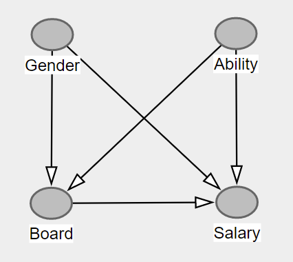
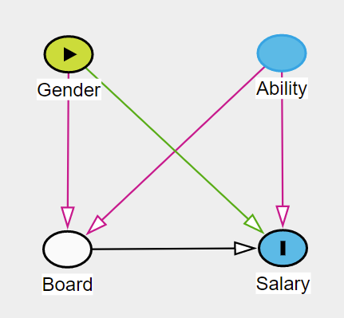

<a href="https://ki-campus.org/">

</a>

```{r setup, include=FALSE}
library(ggplot2)
library(ggdag)
theme.fom <- theme_classic(22*1.04)
theme.fom <- theme.fom
theme_set(
  theme.fom  
)

library(learnr)
library(mosaic)
library(DT)

set.seed(1896)

# Sample size
n <- 1000
# ability, distribution N(100,15) 
ability <- rnorm(n, mean = 100, sd = 15)
# gender, distribution B(0.5) 
gender <- sample(c("f","m"), size = n, replace = TRUE)

# men rise onto the board at ability 115, women rise at 130
board <- ifelse(((gender == "m" & ability > 115) | 
                      (gender == "f" & ability > 130)),
                   "y","n")

# salary: ability * 10 * 2 (if board) * 1.05 (if man)
salary <- ability * 10 * 
  ifelse(board == "y", 2, 1) * 
  ifelse(gender == "m", 1.05, 1)

# Data table
GPG <- data.frame(
  gender = gender,
  ability = round(ability),
  board = board,
  salary = round(salary,-2))
```

## Learning objectives

In this module you will learn to:

- draw a graph based on assumptions about the causal structure,
- use the graph to draw the right consequences for causal inference, and
- run a simulation for the gender pay gap in R.

## A headline

A headline from 11.16.2020 reads ([Link](https://www.zeit.de/news/2020-11/16/frauen-im-board-von-dax-firmen-verdienen-mehr-als-maenner)): 

> Women on company boards are better paid than men

Is that possible? 
People always tend to think that women are *disadvantaged* in the job (and in salary).

But both can be true at the same time: Women can be disadvantaged *and* women can achieve a higher salary as board members than men. 

Correlation does not mean causality. 
Mediators, confounders, and colliders lurk everywhere and can create bias.  

To study causality we need to think about the data generating process: how did the data come about? 
Here: How do the salaries of women and men in board positions come about?

And this is what you have learned in this course &#127942;

## Our assumptions

Here are our qualitative assumptions of the data generating process:

1. *Ability* for the job is independent of *gender*.

2. Whether someone gets on the *board* depends on *ability* and *gender*. 
There can be a wide variety of explanations for the latter: For example, it may be that women are less likely to be promoted to such positions; it may also be that they are less interested in such positions.

3. Someone's *salary* depends on their *ability*, on whether they are on the *board*, and at least potentially also on *gender*.


```{r pfeil1, echo=FALSE}
question("Is there an arrow between *ability* and *gender*?",
  answer("Yes, in the form *ability* $\\rightarrow$ *gender*."),
  answer("Yes, in the form *gender* $\\rightarrow$ *ability*."),
  answer("No.", correct = TRUE, message = "Here we assume that there is no relationship between *ability* and *gender*, so there is no arrow."),
  allow_retry = TRUE,
  correct = random_praise(),
  incorrect = random_encouragement()
)
```

<br>

```{r pfeil2, echo=FALSE}
question("Is there an arrow between *ability* and *board*?",
  answer("Yes, in the form *ability* $\\rightarrow$ *board*." , correct = TRUE, message = "We assume that board membership depends on ability &ndash; and not vice versa."),
    answer("Yes, in the form *board* $\\rightarrow$ *ability*."),
  answer("No."),
  allow_retry = TRUE,
  correct = random_praise(),
  incorrect = random_encouragement()
)
```

## DAGitty

[DAGitty](http://dagitty.net/) is an easy to use tool that allows one to draw (and analyze) causal diagrams in the web browser.

*Note*: The diagrams within this course were generated with the package `ggdag` ([https://ggdag.malco.io/](https://ggdag.malco.io/)).

Use either DAGitty or pen and paper to draw a causal graph that encodes the following assumptions:


1.  *Ability* for the job is independent of *gender*
2. Whether someone gets on the *board* depends on *ability* and *gender*
3. The *salary* a person gets depends on *ability*, *board* membership and *gender*

*Press `Next Topic` once you are done with the graph*

##

<br>

{width="65%"}

1. *Ability* is independent of *gender*. Therefore no arrow between these variables.
2. Whether someone gets on the *board* depends on *ability* and *gender*. Therefore, we add arrows from *gender* to *board* and from *ability* to *board*.
3. The *salary* a person receives depends on the *ability*, on *board* membership and on  *gender*. Therefore, one arrow each from *ability*, *board* and *gender* to *salary*.


```{r collider, echo=FALSE}
question("What role does *board* play in the subgraph from *gender* to *ability*?",
  answer("Mediator"),
  answer("Confounder"),
  answer("Collider", correct = TRUE, message = "Correct &ndash; the two arrows both point into *board*."),
         allow_retry = TRUE,
         correct = random_praise(),
         incorrect = random_encouragement())
```

## A simulation

Let's make additional quantitative model assumptions to be able to simulate data:

1. `ability` follows a normal distribution with $\mu=100$ and $\sigma=15$.

2. `gender` follows a Bernoulli distribution with $\pi=0.5$ for the outcome female

3. We said that whether somebody joins the board depends on `ability` and `gender`. 
We model this by assuming that a man enters the board with an `ability` greater than 115, and a woman enters the board with an `ability` greater than 130. 
So women have to be more able than men to enter the board &ndash; that is the underlying assumption here.


```{r plot, echo=FALSE, fig.align='center', out.width="60%", message=FALSE}
xpnorm(115, mean = 100, sd = 15, return = "plot") %>% gf_labs(title = "Board membership, men", x = "ability", y = "density")
xpnorm(130, mean = 100, sd = 15, return = "plot") %>% gf_labs(title = "Board membership, women", x = "ability", y= "density")
```


4. `salary` depends on `ability` ($\cdot 10$). It is twice as high in the `board` and an additional $5\%$ higher for men. More able people earn more, board members earn more, and men earn more.
$$\text{salary} = \text{ability} \cdot 10 \cdot \begin{cases}2, \,\text{if board} \\ 1, \,\text{otherwise} \end{cases} \cdot \begin{cases}1.05, \,\text{ist male} \\ 1, \,\text{otherwise} \end{cases}$$
```{r plotme2, echo=FALSE, fig.align='center', out.width="60%", message=FALSE}
mov <- data.frame(x1 = 50, x2 = 115, y1 = 50*10*1.05, y2=115*10*1.05)
miv <-  data.frame(x1 = 115, x2 = 150, y1 = 115*10*2*1.05, y2=150*10*2*1.05)
fov <- data.frame(x1 = 50, x2 = 130, y1 = 50*10*1, y2=115*10*1)
fiv <-  data.frame(x1 = 130, x2 = 150, y1 = 115*10*2*1, y2=150*10*2*1)
gf_segment(y1 + y2 ~ x1 + x2, data = mov, color = "purple") %>%
  gf_segment(y1 + y2 ~ x1 + x2, data = miv, color = "purple") %>%
  gf_segment(y1 + y2 ~ x1 + x2, data = fov, color = "orange") %>%
  gf_segment(y1 + y2 ~ x1 + x2, data = fiv, color = "orange") %>%
  gf_labs(x="Ability", y="Salary") +
  annotate("text", label="Men", x = 60, y= 3000, color = "purple")+
  annotate("text", label="Women", x = 60, y= 2500, color = "orange")
```


To simulate this in `R` for e.g. $n=1000$ employees, the following code can be used:

```{r simData}
# load package
library(mosaic)
# set random seed for reproducibility
set.seed(1896)

# sample size
n <- 1000
# ability distribution N(100,15) 
ability <- rnorm(n, mean = 100, sd = 15)
# gender distribution B(0.5)
gender <- sample(c("f","m"), size = n, replace = TRUE)

# rising onto the board: ability 115 for men, ability 130 for women
board <- ifelse(((gender == "m" & ability > 115) | 
                      (gender == "f" & ability > 130)),
                   "y","n")

# salary: ability * 10 * 2 (if board) * 1.05 (if male)
salary <- ability * 10 * 
  ifelse(board == "y", 2, 1) * 
  ifelse(gender == "m", 1.05, 1)

# data table with rounding
GPG <- data.frame(
  gender = gender,
  ability = round(ability),
  board = board,
  salary = round(salary,-2))
```

<br>
<span style="color:#301a87;">&#10146;</span> Here are the simulated data:

```{r, echo=FALSE}
datatable(GPG)
```

## Analysis 1

As constructed according to our assumptions: 

There are no significant differences (here: in arithmetic mean; function `mean()`) in ability between the genders:

```{r meanf}
mean(ability ~ gender, data = GPG)
```

How about the salary?

Change the code to get the arithmetic mean of `salary` by gender:

```{r meang, exercise = TRUE}
mean(ability ~ gender, data = GPG)
```

```{r meang-solution}
mean(salary ~ gender, data = GPG)
```

##

As constructed: 

Men earn on average `r round(mean(salary ~ gender, data = GPG))[2]` -- more than women, whose average salary here is `r round(mean(salary ~ gender, data = GPG))[1]`.

## Analysis 2

What happens if we restrict ourselves to board members, i.e., we select (`filter`) only the observations that satisfy the condition that they are in the board (`board == "y"`):

```{r meangboarde, exercise = TRUE}
GPG %>%
  filter(board == "y") %>%
  mean(salary ~ gender, data = .)
```

## 

```{r meangboard}
GPG %>%
  filter(board == "y") %>%
  mean(salary ~ gender, data = .)
```

Although men earn more overall by construction, women earn more on the board.

Why?

Because they had to be more able to get on the board.

Check this by modifying the code to output the arithmetic mean of the variable `ability` per gender for the board members.

```{r meanfboard, exercise = TRUE}
GPG %>%
  filter(board == "y") %>%
  mean(salary ~ gender, data = .)
```

```{r meanfboard-solution}
GPG %>%
  filter(board == "y") %>%
  mean(ability ~ gender, data = .)
```

<br>

And salary depends not only on gender and board membership, but also on ability.


## Bias

As discussed in Module 6: 

Adjusting a collider (board membership) creates a bias, an illusory context is created that distorts the effect of genders on salary. This can be nicely shown with [DAGitty](http://dagitty.net/):

Press on the gender node and mark it as the *exposure* (in the variable panel on the left). Mark the salary node as the *outcome* and the *board* node as *adjusted.* DAGitty will then change the color of the arrows, highlighting those that bias the effect estimate in red.

{width="75%"}


## AI Campus

[Back to course](https://learn.ki-campus.org/courses/b4f3bf71-74b1-48d8-a4c4-61aef5a808eb/launch)